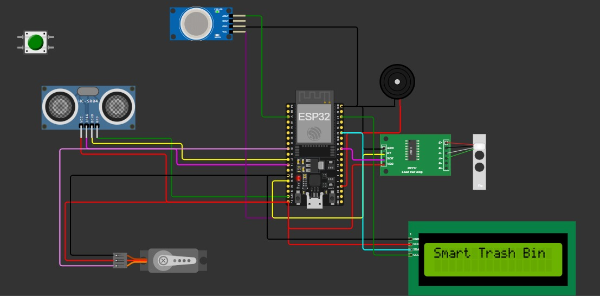

# ♻️ Smart Trash Can
 Smart waste bin automation system using ESP32, Blynk, and real-time sensors — now with a recycling conveyor mechanism!

An IoT-based smart trash can system powered by **ESP32**, integrated with **Blynk**, and equipped with multiple sensors for real-time monitoring and automation. It features **smoke detection (MQ-2)**, **ultrasonic-based distance sensing**, **temperature & humidity monitoring (DHT22)**, an **automated lid with a servo motor**, an **LCD display**, and a **buzzer alert system** — all manageable remotely via the **Blynk mobile app**.

## 📚 Table of Contents

- [Features](#-features)
- [Hardware Used](#-hardware-used)
- [Blynk Virtual Pins](#-blynk-virtual-pins)
- [How It Works](#-how-it-works)
- [How to Run](#️-how-to-run)
- [Tech Stack](#-tech-stack)
- [Project Preview](#-project-preview)
- [Learning Objectives](#-learning-objectives)
- [Future Ideas](#-future-ideas)
- [License](#-license)
- [Author](#-author)

---

## 📌 Features

- 🚪 Auto-opens lid when motion is detected within range
- 🔥 Smoke/gas detection using MQ-2 sensor
- 🌡️ Real-time temperature and humidity readings via DHT22
- 🔊 Buzzer alarm with manual override through Blynk (V2)
- 📱 Live data display and control via Blynk App (V0, V1, V2)
- 📟 I2C LCD shows live sensor values
- ♻️ Conveyor belt system for waste redirection when bin is full
- 🧠 Built on ESP32 using Arduino framework

---

## 🔧 Hardware Used

| Component         | Description                            |
|------------------|----------------------------------------|
| ESP32             | Wi-Fi enabled microcontroller          |
| MQ-2 Gas Sensor   | For smoke and LPG detection            |
| Ultrasonic Sensor | Distance detection (HC-SR04 or similar)|
| DHT22             | Temperature & humidity sensor          |
| Servo Motor       | To open/close trash lid                |
| I2C LCD 16x2      | To show live readings                  |
| Buzzer            | Sound alert for critical gas levels    |
| Blynk App         | Remote monitoring and manual control   |

---

## 📲 Blynk Virtual Pins

| Pin | Function                   |
|-----|----------------------------|
| V0  | Smoke reading (analog)     |
| V1  | Distance reading (cm)      |
| V2  | Manual buzzer ON/OFF toggle|

---

## 🧪 How It Works

1. **Ultrasonic Sensor** measures distance; if < 10 cm → servo opens the lid.
2. **MQ-2 Gas Sensor** detects smoke; triggers buzzer if dangerous.
3. **DHT22 Sensor** captures environmental temperature & humidity.
4. **LCD 16x2** shows real-time smoke and distance.
5. **Blynk App** provides remote monitoring and buzzer override.
6. **Trash Full Condition** When the trash is full, the system activates a servo mechanism to release waste onto a manually built conveyor belt, which transports the trash to a separate recycling bin.

---

## 🖥️ How to Run

1. Flash the Arduino code to ESP32 using Arduino IDE.
2. Install required libraries:
   - `BlynkSimpleEsp32`
   - `ESP32Servo`
   - `LiquidCrystal_I2C`
   - `DHTesp`
3. Set up your Blynk template and get the `BLYNK_AUTH_TOKEN`.
4. Connect to your Wi-Fi and Blynk app.
5. Power the ESP32 and monitor via Serial Monitor or Blynk UI.

---

## 🧰 Tech Stack

- ⚙️ **Platform:** ESP32 (Wi-Fi microcontroller)
- 💻 **Programming Language:** Embedded C (Arduino)
- 📱 **IoT Platform:** Blynk
- 🔌 **Sensors & Modules:** MQ-2, DHT22, Ultrasonic, Servo, LCD I2C

---

## 📸 Project Preview 
### 🪛 Circuit Diagram

👉 **[View the Full Code Here](https://github.com/ZiyadAzzaz/IOT-Smart-Bin/blob/main/Smart_Bin.cpp)**

---
## 🎯 Learning Objectives

- Practice hardware-software integration with ESP32
- Use real-time data in mobile IoT dashboards
- Learn sensor interfacing: MQ-2, ultrasonic, DHT22
- Build a physical waste-sorting and automation mechanism

---

## 💡 Future Ideas

- AI model for waste classification
- Voice notification module
- Node-RED dashboard integration
- Weight Sensor

---

## 📄 License

This project is licensed under the [MIT License](LICENSE).

---

## 🙋‍♂️ Author

Developed by Ziyad Azzaz  
GitHub: [https://github.com/ZiyadAzzaz](https://github.com/ZiyadAzzaz)

